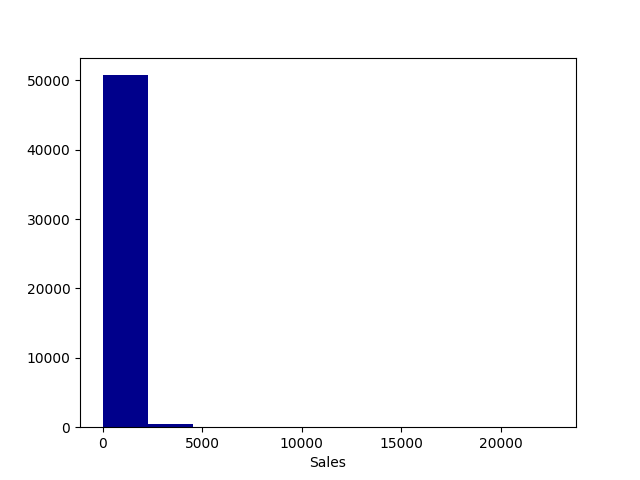
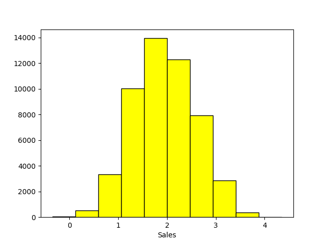
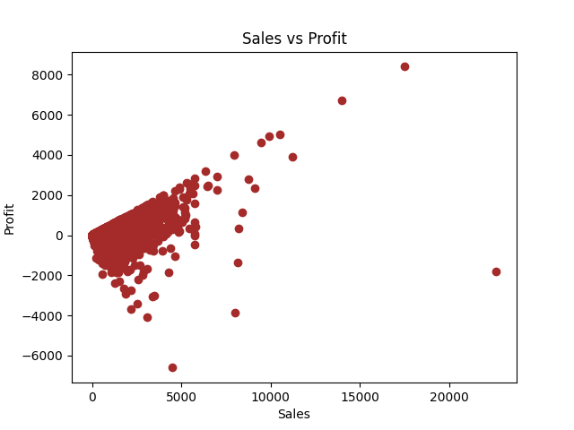
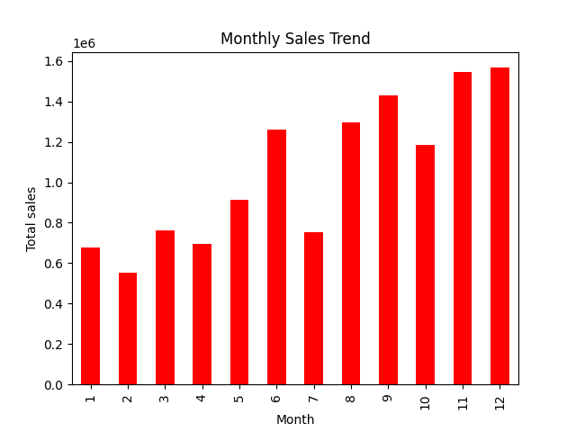
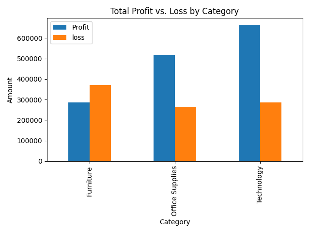
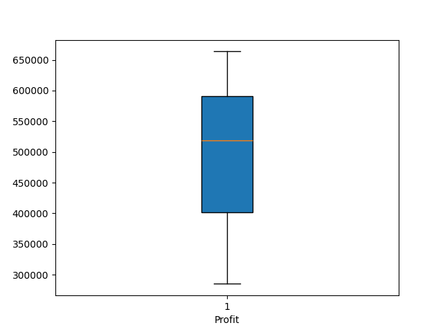
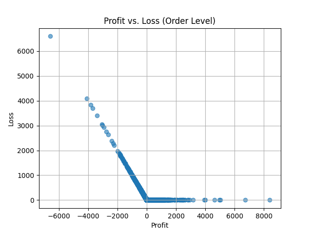
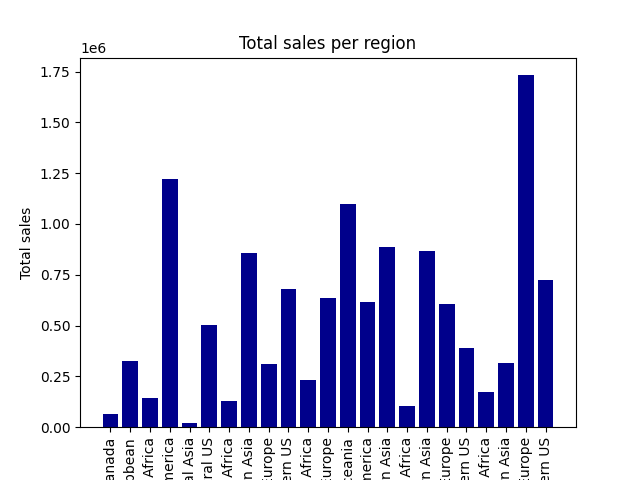
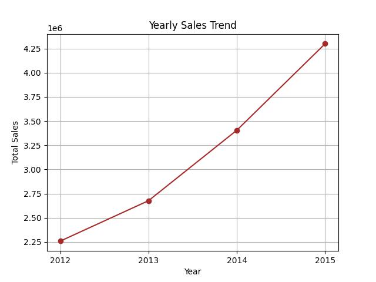

# 📊 Global Superstore 2016 Sales Analysis

## 📌 Project Overview
This project performs an **Exploratory Data Analysis (EDA)** on the **Global Superstore 2016** dataset to uncover insights about sales performance, profitability, customer behavior, and product trends.

---

## 📂 Dataset Information
- **File:** `global_superstore_2016.xlsx`
- **Description:** Contains transactional data from a fictional superstore including:
  - Order details
  - Customer information
  - Product details
  - Sales, profit, and quantity
  - Geographic location

---

## 🛠️ Tools & Libraries
- **Python 3**
- **pandas** – Data manipulation
- **numpy** – Numerical operations
- **matplotlib** – Data visualization
- **seaborn** – Statistical plotting
- **Jupyter Notebook** – Interactive analysis

---

## 🔍 Analysis Steps in the Notebook
1. **Data Loading & Inspection**
   - Loaded dataset using `pandas.read_excel`
   - Viewed shape, column names, data types, and sample records
   - Checked for missing values and duplicates
   - Summary statistics with `.describe()`

2. **Basic Metrics**
   - Count of unique customers and products
   - Identified country with highest sales
   - Top 10 products by **Sales** and **Profit**

3. **Visualizations**
   - Histogram of Sales distribution  
     

   - Log-transformed Sales distribution  
     

   - Scatter plot of **Sales vs Profit**  
     

   - Monthly sales trends  
     

   - Sales and profit by category & sub-category  
     

   - Boxplot of Profit distribution  
     

   - Profit vs. Loss (Order Level)  
     

   - Sales per region  
     

   - Yearly sales trend  
     

4. **Group Analysis**
   - Aggregated sales by month
   - Category-wise and region-wise analysis

---

## 📈 Key Insights
- Sales distribution is right-skewed; most orders have low sales value.
- Certain products generate high revenue but low profit margins.
- Clear seasonal trends with peaks in certain months.
- Furniture category has lower profitability compared to Technology.

---

## 🚀 How to Run
1. Clone this repository:
   ```bash
   git clone https://github.com/subhiksha-kodi/EDA-PROJECT---GLOBAL-SUPERSTORE-SALES-ANALYSIS.git
